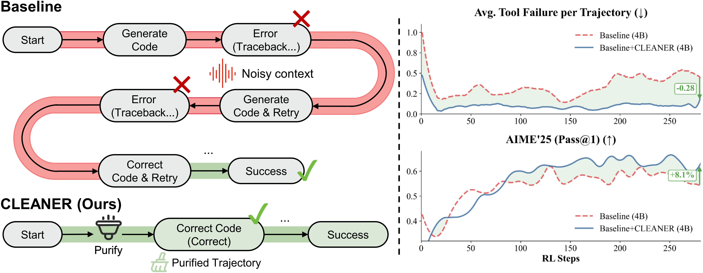

<div align="center">
  <h3>CLEANER: Self-Purified Trajectories Boost Agentic Reinforcement Learning</h3>
</div>

<p align="center">
  <a href="https://arxiv.org/abs/2601.15141">
    
  </a>
  <a href="https://huggingface.co/TianshiXu/CLEANER-4B">
    
  </a>
</p>

<p align="center">
  
</p>

## Introduction

- **We propose CLEANER**, which resolves the credit assignment dilemma in agentic RL by training on **self-purified trajectories**. This enables models to internalize correct reasoning patterns while filtering out execution noise.
- **We introduce the SAAR mechanism** to autonomously construct these clean signals. SAAR adaptively repairs failures—ranging from minor syntax typos to deep logical flaws—without the computational overhead of supersampling.
- **We show state-of-the-art efficiency and performance.** CLEANER improves accuracy by **6%** on AIME and **5%** on LiveCodeBench, and matches SOTA performance using only **one-third** of the training steps.
- **We provide a fully reproducible pipeline** and release code, environment configs, and processed datasets via GitHub to support further research.

This project is organized and extended based on [DemyAgent](https://github.com/Gen-Verse/Open-AgentRL). The training datasets are also sourced from that project; if you use them, please cite it as well (see the citation at the end).

## Get Started

### 1. Install the VeRL Environment

CLEANER is trained with the VeRL framework. We recommend using the latest VeRL to ensure the best performance (e.g., keep a fork updated). A Docker-based setup is recommended; a working example is shown below. As VeRL evolves, image tags may change, but the following image is compatible with the latest version at the time of writing:

```bash
docker pull verlai/verl:app-verl0.6-transformers4.56.1-sglang0.5.2-mcore0.13.0-te2.2
docker create --runtime=nvidia --gpus all --net=host --shm-size="10g" --cap-add=SYS_ADMIN --name verl IMAGE_ID sleep infinity
docker start verl
docker exec -it verl bash
```

Other official VeRL installation options are supported; see the [VeRL documentation](https://verl.readthedocs.io/en/latest/start/install.html).

### 2. Install CLEANER

Inside the Docker container, clone this repository and install dependencies:

```bash
sudo apt-get update -y
sudo apt install tmux -y
sudo apt-get install -y libglib2.0-0
sudo apt-get install redis -y
cd Open-CLEANER
pip install -r code-judge/requirements.txt
pip install -e code-judge
cd verl && pip install -e .[sglang] && cd ..
```

The commands above install the required dependencies: Code-judge and VeRL.

## Training

### 1. Download Datasets & Filter the Dataset

The datasets used by CLEANER come from the [DemyAgent](https://github.com/Gen-Verse/Open-AgentRL) project. We provide the original dataset links here:

- [🤗 30K Agentic RL Data](https://huggingface.co/datasets/Gen-Verse/Open-AgentRL-30K)
- [🤗 Agentic RL Evaluation Data](https://huggingface.co/datasets/Gen-Verse/Open-AgentRL-Eval)

Recommended dataset layout:

```text
/Open-CLEANER
  /dataset
    /Open-AgentRL-30K
    /Open-AgentRL-Eval
```
**Note**: For the Qwen2.5-7B model, we recommend filtering the 30K dataset to remove questions that are too easy or too difficult. The file `dataset/Open-AgentRL-30K/Open-AgentRL-30K.filtered.parquet.success.jsonl` records pass rates from 8 rollouts of the Qwen2.5-7B-RA-SFT model. You can filter the dataset using:

```bash
bash data_filter.sh
```
You can tune `success_rate_ratios` to control retention ratios across difficulty levels. The default configuration reflects our best empirical results. The script generates a new dataset file at `dataset/Open-AgentRL-30K/filtered_sr.parquet`, which can be used directly to train CLEANER-7B.
### 2. Cold-Start SFT

Since CLEANER primarily improves the RL stage, we recommend downloading the Cold-Start SFT checkpoints provided by [DemyAgent](https://github.com/Gen-Verse/Open-AgentRL) to save time:

| Model | Link |
| --- | --- |
| Qwen2.5-7B-RA-SFT | [🤗 HuggingFace](https://huggingface.co/Gen-Verse/Qwen2.5-7B-RA-SFT) |
| Qwen3-4B-RA-SFT | [🤗 HuggingFace](https://huggingface.co/Gen-Verse/Qwen3-4B-RA-SFT) |

### 3. RL Training with CLEANER

After downloading the datasets and SFT checkpoints, follow the steps below to start RL training.

- Start the `code-judge` service (used to execute tool-call code generated by the model):
  - Configure `code_judge_url` in `verl/utils/reward_score/livecodebench/code_math.py` (it is already set by default).
  - Run the following commands to start the service:

    ```bash
    redis-server --daemonize yes --protected-mode no --bind 0.0.0.0
    redis-cli ping
    tmux new-session -d -s server 'cd ./code-judge && MAX_EXECUTION_TIME=4 REDIS_URI="redis://localhost:6379" RUN_WORKERS=0 uvicorn app.main:app --host 0.0.0.0 --port 8088 --workers 16 2>&1 | tee server.log'
    tmux new-session -d -s worker 'cd ./code-judge && MAX_EXECUTION_TIME=4 REDIS_URI="redis://localhost:6379" MAX_WORKERS=64 python run_workers.py 2>&1 | tee worker.log'
    ```

  - Verify the service:

    ```bash
    curl -X POST http://0.0.0.0:8088/judge -H "Content-Type: application/json" -d '{"type":"python","solution":"print(\"hello world\")","expected_output":"hello world\n"}'
    ```

- The `recipe/cleaner` folder contains scripts for training CLEANER and baselines (including baseline-notool). Run `bash recipe/cleaner/qwen3_4b_cleaner.sh` to train CLEANER-4B; other scripts are similar. Key parameters to configure:
  - `train_dataset`: RL dataset path, e.g., `dataset/Open-AgentRL-30K/Open-AgentRL-30K.parquet`. Other dataset/model paths follow the same pattern.
  - `WANDB_API_KEY`: your Weights & Biases API key for logging. You can also login via CLI to avoid setting this in the script.
  - `OUTPUT_DIR`: output path for checkpoints and logs.
  - `num_GPU`: number of GPUs to use.
  - `resume_dir`: resume path; add `trainer.resume_mode=resume_path` and `trainer.resume_from_path=$resume_dir` when resuming.

- CLEANER-specific parameters that control the SAAR mechanism:
  - `+actor_rollout_ref.rollout.multi_turn.enable_tool_rollback`: set `True` to enable SAAR. Requires `+actor_rollout_ref.rollout.multi_turn.max_tool_retries` (we recommend `3`).
  - SAAR similarity threshold $\gamma$: in `verl/verl/experimental/agent_loop/tool_agent_loop.py`, replace `0.5` in `should_replace_reasoning = (similarity < 0.5)` with your desired threshold.
  - `+actor_rollout_ref.rollout.multi_turn.rollback_probability`: rollback probability. We recommend `0.7` for Qwen2.5-7B and `1.0` for Qwen3-4B.
  - `actor_rollout_ref.actor.fsdp_config.dtype` and `actor_rollout_ref.rollout.dtype`: we recommend setting both to `float16` to reduce train/infer mismatch.
  - `+algorithm.rollout_correction.rollout_is`: enables IS correction for train/infer mismatch. CLEANER should disable this; otherwise it introduces logits recomputation for overwritten segments. Baselines can enable it, though we found limited gains.
  - `save_negative_samples`, `use_dpo_on_tool_calls`, `dpo_beta`, and `dpo_max_adjustment_ratio`: parameters for negative-sample DPO (a failed attempt; see the appendix). Keep them disabled by default.

## Evaluation
| Model | Link |
| --- | --- |
| CLEANER-4B | [🤗 HuggingFace](https://huggingface.co/TianshiXu/CLEANER-4B) |

Evaluate AIME and GPQA:

```bash
bash recipe/cleaner/eval/eval_qwen3_4b_aime_gpqa.sh
```

For CLEANER evaluation, enable `+actor_rollout_ref.rollout.multi_turn.enable_tool_rollback=True` and `+actor_rollout_ref.rollout.multi_turn.max_tool_retries=3` by default.

Evaluate LiveCodeBench:

```bash
bash recipe/cleaner/eval/eval_qwen3_4b_livecodebench.sh
```

This generates trajectories under `VAL_SAVE_PATH`. Follow the **Custom Evaluation** section in the [LiveCodeBench](https://github.com/LiveCodeBench/LiveCodeBench) repository. You will need to align the generated trajectories with their `question_id` and convert them to the LiveCodeBench format. The `question_id` is in `dataset/Open-AgentRL-Eval/livecodebench-v6/lcb_v6_2502_2505.parquet`.

## SAAR Rollback Implementation at a Glance

The core implementation lives in [verl/verl/experimental/agent_loop/tool_agent_loop.py](verl/verl/experimental/agent_loop/tool_agent_loop.py) (all changes are marked with `#CLEANER`). Key flow:

- Entry & config: `ToolAgentLoop.__init__()` wires rollback parameters; `RollbackManager` controls enablement, max retries, and error-pattern matching.
- Trigger & detection: `_handle_processing_tools_state()` executes tool calls, using `_detect_errors()` / `_detect_error_from_text()` to classify failures from tool responses.
- Rollback core: `_handle_rollback()` appends error feedback, regenerates tool calls, and uses `_overwrite_last_assistant_turn()` to either replace only the tool-call segment or the full assistant turn.
- Token-level replacement: `_split_tool_call_segment()` and `_find_tool_call_token_boundary()` locate tool-call boundaries at the token level to preserve reasoning prefixes when possible.
- Stats & samples: `AgentData` tracks retries, tool-call stats, and optional negative samples; `_call_tool()` records first-attempt success/failure reasons.

Start from `ToolAgentLoop._handle_rollback()` and follow `_handle_processing_tools_state()` → `_overwrite_last_assistant_turn()` → `_split_tool_call_segment()` to understand the full rollback path.

## 📝 Citation

If you use Open-CLEANER, please cite our paper:

```bibtex
@misc{xu2026cleanerselfpurifiedtrajectoriesboost,
  title={CLEANER: Self-Purified Trajectories Boost Agentic Reinforcement Learning},
  author={Tianshi Xu and Yuteng Chen and Meng Li},
  year={2026},
  eprint={2601.15141},
  archivePrefix={arXiv},
  primaryClass={cs.LG},
  url={https://arxiv.org/abs/2601.15141}
}
```

**Note**: Please also cite the original [DemyAgent](https://arxiv.org/abs/2305.10411) paper if you use datasets or code from that project.

